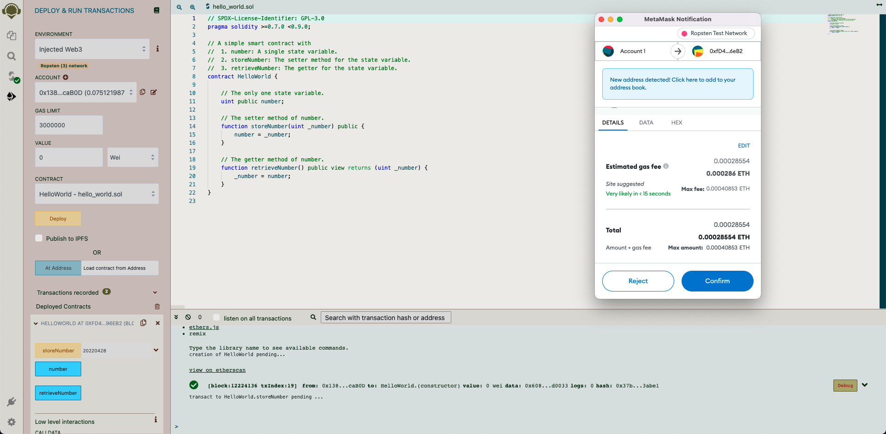

# Background Assignment

- Author: Nobuhiko Otoba
- Link to the GitHub repository: [https://github.com/nobutoba/harmonyzku](https://github.com/nobutoba/harmonyzku/tree/background_assignment)
- Reference: [harmonyone](https://harmonyone.notion.site/Background-Assignment-a0d3855f9b9d4728a58b481c30ecfd3f)

## Assignment A. Conceptual Knowledge

### A-1. What is a smart contract?

> What is a smart contract? How are they deployed? You should be able to describe how a smart contract is deployed and the necessary steps.

#### *What is a smart contract?*

To understand what a smart contract is in the Ethereum ecosystem,
two reliable sources that I find particularly informative are
the book [Mastering Ethereum](https://www.oreilly.com/library/view/mastering-ethereum/9781491971932/) and
the [ethereum.org](https://ethereum.org/en/) website,
which explain the term as follows.

- ([Mastering Ethereum](https://github.com/ethereumbook/ethereumbook/blob/first_edition_first_print/07smart-contracts-solidity.asciidoc))
    In this book, we use the term “smart contracts” to refer to immutable computer programs that run deterministically in the context of an Ethereum Virtual Machine as part of the Ethereum network protocol—i.e., on the decentralized Ethereum world computer.
- ([ethereum.org](https://ethereum.org/en/smart-contracts/))
    Smart contracts are the fundamental building blocks of Ethereum applications. They are computer programs stored on the blockchain that allows us to convert traditional contracts into digital parallels. Smart contracts are very logical - following an if this then that structure. This means they behave exactly as programmed and cannot be changed.

For an object-oriented programmer,
a smart contract, once deployed on an Ethereum network,
is like an instance of a class which we can interact with through its methods.
A caveat of this analylogy is that
a smart contract is public to the blockchain on which it is deployed.
Anyone who has access to the blockchain can interact with the contract.

Note that, as explained in the book,
the term "smart contracts" is somewhat misleading in that **they are not necessarily legally-binded agreements**.
According to a [Wikipedia article](https://en.wikipedia.org/wiki/Distributed_ledger_technology_law), "Smart contracts, which are also enforceable legal contracts and were created through interaction of lawyers and developers, are called smart legal contracts."
When we deploy a smart contract on an Ethereum network as described below,
it does not have anything to do with law.

#### *How are they deployed?*

In Ethereum, the deployment process of a smart contract typically goes as follows.

1. **Write a source code of a smart contract.**
    Using a special-purpose language (e.g. Solidity),
    we write a human-readable source code of a smart contract
    (e.g. a text file with a .sol extension).
    Other choices of smart contract languages include Vyper and Yul.

2. **Compile the source code into byte code.**
    If the source code is written in Solidity,
    then the Solidity Compiler does the job:
    it outputs a machine-readable byte code out of a SOL file.

3. **Deploy the contract byte code to a blockchain.**
    In this final step, we first choose and connect to an Ethereum network such as

    - the Ethereum Mainnet (ETH),
    - a public testnet (e.g. Ropsten, Kovan, Rinkeby, Goerli), or
    - a local network (e.g. one that Ganache runs at localhost:8545).

    We then send a contract creation transaction to the Ethereum network
    and wait for the transaction to be added to the corresponding blockchain.
    The contract creation transaction contains the compiled byte code produced in the previous step as data payload.

An example of the deployment process using the Remix IDE can be found in [Sect. B-1](#b-1-hello-world-contract).

### A-2. What is gas?

> What is gas? Why is gas optimization such a big focus when building smart contracts?

#### *What is gas?*

Two quotes again from the same book and website:

- ([Mastering Ethereum](https://github.com/ethereumbook/ethereumbook/blob/first_edition_first_print/glossary.asciidoc))
    A virtual fuel used in Ethereum to execute smart contracts. The EVM uses an accounting mechanism to measure the consumption of gas and limit the consumption of computing resources (see "Turing complete").
- ([ethereum.org](https://ethereum.org/en/developers/docs/gas/))
    Gas is essential to the Ethereum network. It is the fuel that allows it to operate, in the same way that a car needs gasoline to run.

Whenever an account (an EOA or a contract account) sends a transaction
to send ETH, create a contract, or execute a function,
the account has to pay the gas.
The amount of gas depends on the computational power necessary to complete the transaction.

#### *Why is gas optimization important?*

The importance of gas optimization can be well understood via the analogy
between gas in Ethereum and gasoline for cars;
optimization is important 1) **to spare money** and 2) **to be eco-friendly**.

After a smart contract is deployed on an Ethereum network,
anyone (or even other smart contracts) may send transactions to it.
For example, if one contract provides a functionality with the gas amount of 1,000,000
and the other the same functionality with 2,000,000 gas,
then the former one is strongly preferred over the latter one for the following two reasons.

1.
    Any account which calls the functionality will be able to halve the gas consumption and ETH in turn&mdash;thus **sparing money**.
1.
    Any physical instantiation of the EVM is likely to execute less operations
    since every EVM opcode has the corresponding (static or dynamic) gas cost
    reflecting its computational complexity.
    It is thus more **eco-friendly** to use the 1,000,000-gas contract than the 2,000,000-gas one.

### A-3. What is a hash?

> What is a hash? Why do people use hashing to hide information?

#### *What is a hash?*

A hash is a "fixed-length fingerprint of variable-size input, produced by a hash function" ([Mastering Ethereum](https://github.com/ethereumbook/ethereumbook/blob/first_edition_first_print/glossary.asciidoc)).
For example, Python's standard library `hashlib`
(which seems to invoke OpenSSL under the hood)
uses the FIPS-202 SHA-3 hash function,

```python
>>> import hashlib
>>> hashlib.sha3_256(b"").hexdigest()
'a7ffc6f8bf1ed76651c14756a061d662f580ff4de43b49fa82d80a4b80f8434a'
```

whereas the JavaScript API `web3.js` uses the Keccak-256 hash function.

```js
> const Web3 = require("web3");
> Web3.utils.sha3Raw("")
'0xc5d2460186f7233c927e7db2dcc703c0e500b653ca82273b7bfad8045d85a470'
```

In the examples above,
the respective hashes of the empty sequence of bytes,
produced by the FIPS-202 SHA-3 and the Keccak-256 hash functions,
are the hexadecimals `'a7ffc6...'` and `'c5d246...'` (both 256 bits).

#### *Why do people use hashing to hide information?*

People often would like to hide information to other peple but, at the same time,
have to show they actually know that information.
In such a case, after converting the secret information to raw bytes if necessary,
it makes sense for a prover to show its hash value to a verifier
while hiding the raw bytes themselves.
If the hash function has resistance to hash collisions,
it is infeasible for the verifier to guess the secret from the hash value provided;
it is also infeasible, when the prover actually does not know the secret,
to pretend as if she knows it.
This approach to use hashing to hide information, though,
has a major drawback that it is theoretically possible for a malicious verifier
to guess the information from the hash value through a brute force attack.

### A-4. Two different-colored objects

> How would you prove to a colorblind person that two different colored objects are actually of different colors? You could check out Avi Wigderson talk about a similar problem [here](https://www.youtube.com/watch?v=5ovdoxnfFVc&t=4s).

#### *The setting*

I refer to the two different-colored objects as `obj1` and `obj2`
and assume that the identifiers (that is, "1" and "2") are visible to everyone including the colorblind person.
For example,

1.
   Prepare two pieces of A4 white paper.
1.
    Paint both sides of one in red and both sides of the other in green
    so that the challenger with Deuteranomaly cannot distinguish between the two.
1.
    On one side of the red paper, put a physical sticky note with 1 written on it.
    On one side of the green paper, put a physical sticky note with 2 written on it.

    ```shell
         ┏━━━━━━━┓       ┏━━━━━━━┓           ┏━━━━━━━┓       ┏━━━━━━━┓
         ┃ ┌───┐ ┃       ┃ ┌───┐ ┃           ┃       ┃       ┃       ┃
         ┃ │ 1 │ ┃       ┃ │ 2 │ ┃           ┃       ┃       ┃       ┃
         ┃ └───┘ ┃       ┃ └───┘ ┃           ┃       ┃       ┃       ┃
         ┗━━━━━━━┛       ┗━━━━━━━┛           ┗━━━━━━━┛       ┗━━━━━━━┛
        (front of 1)    (front of 2)        (back of 1)     (back of 2)
    ```

#### *The procedure*

I (the *prover*) know that the two pieces `obj1` and `obj2` of A4 paper have different colors,
but the colorblind challenger (the *verifier*) is suspicious.
To convince her, we proceed as follows.

1.
    Put the two pieces of paper face-down on the table so that the labels (the sticky notes) are invisible.
2.
    The verifier
    1. randomly chooses one of the two pieces of paper,
    2. checks the label ("1" or "2") on the back,
    3. shows only the front of the paper to the prover,
    4. and puts the paper back on the table (again face-down).
3.
    The verifier randomly shuffles the two pieces of paper on the table.
    The prover must not watch this process.
4.
    The prover
    1. chooses one of the two pieces of paper,
    2. shows the label ("1" or "2") to the verifier, and
    3. claims that it has the same color as the one shown from the verifier on Step 2-3.
5.
    The verifier checks that the labels that she witnessed on Steps 2-2 and 4-2 coincide.
6.
    Continue Steps 1 to 5 until the verifier is convinced.

#### *Degree of conviction*

The verifier is 50%-convinced after one round of Steps 1 to 5 is successfully completed.
After N rounds of Steps 1 to 5 are successfully completed,
the verifier is (p(N) * 100)%-convinced where p(N) = 1 - (1/2) ** N.
For example, after successful 5 rounds, the verifier is 96.875%-convinced
that the prover indeed knows that the two pieces of paper have different colors.

#### *Similarity with the example of three-colorable maps*

If I labeled the two pieces of paper with their actual colors
(i.e. if I wrote "red" and "green" instead of "1" and "2"),
then, at the price of revealing my knowledge of their colors,
I could have equally convinced the colorblind person
that the two objects had two different colors.
In contrast, the procedure 1&ndash;6 above has a characteristic that
it proves that I know the two pieces of paper have different colors
while hiding my knowledge of their actual colors (red and green).
This is similar to the example of three-colorable maps on [NumberPhile2](https://www.youtube.com/watch?v=5ovdoxnfFVc&t=4s),
in which a prover is able to convince a verifier that a particular map is three-colorable
while not telling the actual coloring of the map.

## Assignment B. You sure you’re solid with Solidity?

### B-1. Hello World contract

> Program a super simple "Hello World" smart contract: write a `storeNumber` function to store an unsigned integer and then a `retrieveNumber` function to retrieve it. Clearly comment your code. Once completed, deploy the smart contract on [remix](http://remix.ethereum.org/). Push the .sol file to Github or Gist and include a screenshot of the Remix UI once deployed in your final submission pdf.

#### *Hello world source code*

- GitHub URL: [hello_world.sol](https://github.com/nobutoba/harmonyzku/blob/background_assignment/background_assignment/src/hello_world.sol)
- Local path [./src/hello_world.sol](./src/hello_world.sol)

#### *Hello world Screenshots*

1. Write a Solidity source code of the "Hello World" smart contract.

    

2. Compile the source code into bytecode.

    

3. Deploy the contract to the Ropsten test network.

    

    

4. Call the functions `storeNumber` and `retrieveNumber`.

    

    

### B-2. Ballot contract

> On the documentation page, [the “Ballot” contract](https://docs.soliditylang.org/en/v0.8.11/solidity-by-example.html#voting) demonstrates a lot of features on Solidity. Read through the script and try to understand what each line of code is doing.

#### *Version difference*

For comparison purposes, I created a copy ([ballot.sol](./src/ballot.sol)) of the `Ballot` contract source code from the Solidity documentation **v0.8.13**,
which can also be found at their GitHub reposirty ([voting.rst](https://github.com/ethereum/solidity/blob/v0.8.13/docs/examples/voting.rst)).
In fact, the link in the assignment explicitly points to Solidity documentation **v0.8.11**,
but there were bug fixes (commits [942a33](https://github.com/ethereum/solidity/commit/942a3301dc2b0117567cc5c6e8253f226e98fbbb) and [6fbfa3](https://github.com/ethereum/solidity/commit/6fbfa33486ba4bd1c6c3a9953566788df7546c78)) on Dec 29, 2021
on the `Ballot` contract source code, so I will use the latest version here and henceforth.

#### *Voting without delegation*

As they say "We will not solve all problems here, but at least we will show how delegated voting can be done,"
this is a bare ballot contract **with an added functionality of delegating votes to others**.

To understand each and every line of code,
I stripped the voting delegation functionality from the original source code and wrote `BallotWithoutDelegate` contract on [ballot_without_delegate.sol](./src/ballot_without_delegate.sol),
**which implements a minimal voting functionality**.
This makes things simpler and helps our understanding of the original Ballot contract.
Some observations from the simplified contract are in order:

1.
    At first sight, the existence of both `weight` and `voted` attributes of the `Voter` struct seems to be redundant,
    as the `weight` attribute can now only take 0 or 1 after delegation is gone.

    ```solidity
    struct Voter {
        uint weight; // weight is accumulated by delegation
        bool voted;  // if true, that person already voted
        uint vote;   // index of the voted proposal
    }
    ```

    However, as it turns out, **both `weight` and `voted` attributes are still necessary**.
    To see this, it is illustrative to look at the following two `require` statements within the `vote` function.

    ```solidity
    function vote(uint proposal) external {
        Voter storage sender = voters[msg.sender];
        require(sender.weight != 0, "Has no right to vote");
        require(!sender.voted, "Already voted.");
        ...
    ```

    After all, **we have to distinguish the following three cases 1, 2, and 4**
    even for the present case of `BallotWithoutDelegate`,
    and a single attribute is not sufficient for this purpose.

    1. `!voted && weight == 0`:
        The message sender **has never had right to vote**
        (he/she has a chance to be given the right to vote at some point in the future, though).
    2. `!voted && weight == 1`:
        The message sender **has right to vote but has not yet voted**.
    3. `voted && weight == 0`:
        This combination is **impossible**:
        Note that the `weight` attributes never decrease:
        The lifecycle of a `Voter` struct is 1 -> 2 -> 4,
        where the state transitions represented by the arrows may or may not occur.
    4. `voted && weight == 1`:
        The mssage sender **had right to vote in the past and has already voted**.

    The same applies to the original `Ballot` contract.

1.
    The list of proposals are set by the chairperson at the time of deployment and will never change thereafter.
    The same applies to the original `Ballot` contract.

1.
    To save gas, only `bytes32`-encoded data (not string) can be used when the chairperson sets the proposals at the time of deployment or when anyone tries to access the  winner name.
    The same applies to the original `Ballot` contract.
    To convert a string to `bytes32` and vice versa, I wrote convenience functions  `stringToBytes32` and `bytes32ToString` which are meaned to be inverse to each other in [converter.js](./src/converter.js).
    For example, in the Node.js REPL:

    ```js
    > const Converter = require("./converter.js");
    > const b = Converter.stringToBytes32("Bob");
    > b
    '0x426f620000000000000000000000000000000000000000000000000000000000'
    > Converter.bytes32ToString(b)
    'Bob'
    ```

1.
    After deploying `BallotWithoutDelegate`,
   **voting never ends and the "result" of the vote changes from time to time**. The chairperson may continue to grant rights to vote forever,
   and people with voting rights may postpone voting for an unlimited period of time.
   The same applies to the original `Ballot` contract.
   It motivates to add voting time in the following exercises.

#### *The original `Ballot` contract*

We now go back to the original `Ballot` contract
and look at the voting delegation functionality.

Notice that a `require` statement is missing in the `delegate` function,
so that anonymous accounts who don't have voting rights may call it.
**I created a pull request regarding this issue** [here](https://github.com/ethereum/solidity/pull/12956)
(status on 2022-05-12: Accepted and merged in the `develop` branch).
Otherwise, the function is carefully written so as to prevent:

1. Delegation from accounts who already voted or delegated.
2. Delegation to an account who has no right to vote.
3. Delegation-loop formation from happenning.

### B-3. Ballot contract with voting period

> Suppose we want to limit the voting period of each Ballot contract to **5 minutes**. To do so, implement the following: Add a state variable `startTime` to record the voting start time. Create a [modifier](https://www.youtube.com/watch?v=b6FBWsz7VaI) `voteEnded` that will check if the voting period is over. Use that modifier in the `vote` function to forbid voting and revert the transaction after the deadline.

#### *Problem formulation*

Previous examination of the Ballot contract source code reveals
that voting using the `Ballot` contract never ends.
To fix the issue, I divide the time period into the following:

1. Pre-voting period.
    Starts as soon as the contract is deployed on the blockchain and ends after 3 minutes. In this period:
    - Chairperson MAY give rights to vote.
    - People MAY NOT vote or delegate.
2. Voting period.
   Starts as soon as the announcement period ends (thus 3 minutes after the deployment) and ends after 5 minutes (thus 8 minutes after the deployment).
   - People MAY vote or delegate.
   - Chaiperson MAY NOT give rights to vote.
3. Post-voting period. Starts as soon as the voting period ends.
   - People MAY NOT vote or delegate.
   - Chaiperson MAY NOT give rights to vote.

```bash
| deployment | pre-voting (3 min) | voting (5min) | post-voting
```

Note that any account MAY check who's the winner at any time.
On the other hand, an account without voting right MAY NOT vote
(or delegate, as soon as [my pull request](https://github.com/ethereum/solidity/pull/12956) is merged).

#### *Handling time in Ethereum*

- The `block.timestamp` value in Solidity, or the `TIMESTAMP` EVM opcode, represents current block's Unix timestamp in seconds.
- To convert the timestamp in Ethereum to a more human-readable format, I wrote a convenience function `evmTimestampToString` in [converter.js](./src/converter.js).
  For example, in the Node.js REPL:

  ```js
  > const Converter = require("./converter.js");
  > Converter.evmTimestampToString(1651134974);
  'Thu Apr 28 2022 17:36:14 GMT+0900 (Japan Standard Time)'
  ```

### B-4. Deploy the ammended Ballot contract

> Deploy your amended script and test the newly implemented functionality in part 3. Submit (1) your amended version of the contract on Github or Gist and (2) screenshots showing the time of contract deployment as well as the transaction being reverted once past the voting period.

#### (1) *Amended Ballot source code*

- GitHub URL: [ballot_with_voting_period.sol](https://github.com/nobutoba/harmonyzku/blob/background_assignment/background_assignment/src/ballot_with_voting_period.sol)
- Local path: [./src/ballot_with_voting_period.sol](./src/ballot_with_voting_period.sol)

#### (2) *Amended Ballot screenshots*

1. The chairperson deploys the contract and the pre-voting period starts.

    The following constructor argument corresponds to the list `["Bob", "Kevin", "Stuart"]`.

   ```js
   [
     "0x426f620000000000000000000000000000000000000000000000000000000000",
     "0x4b6576696e000000000000000000000000000000000000000000000000000000",
     "0x5374756172740000000000000000000000000000000000000000000000000000"
   ]
   ```

   The address of the chairperson is `0x5B38Da6a701c568545dCfcB03FcB875f56beddC4`.

    

2. Pre-voting starts.

    1. The chairperson grants rights to vote to:

        - Agnes = `0xAb8483F64d9C6d1EcF9b849Ae677dD3315835cb2`
        - Edith = `0x4B20993Bc481177ec7E8f571ceCaE8A9e22C02db`
        - Margo = `0x78731D3Ca6b7E34aC0F824c42a7cC18A495cabaB`

        

    1. Edith tries to vote but can't because it's too early.

        

3. The pre-voting period ends, and voting starts.

    1. Agnes delegates her vote to Margo, and Margo votes for Kevin (proposal index 1).

        

    2. Edith does nothing.
    3. Felonius (`0x617F2E2fD72FD9D5503197092aC168c91465E7f2`) tries to vote for Bob but can't because he has not given right to vote.

        

    4. The chairperson tries to give Felonius right to vote but can't because the deadline has already passed.

        

4. Voting ends.

    1. Edith tries to vote for Stuart but can't because the deadline has already passed.

        

    2. Felonius sees that Kevin wins, with two votes in total (from Agnes and Margo).

       
